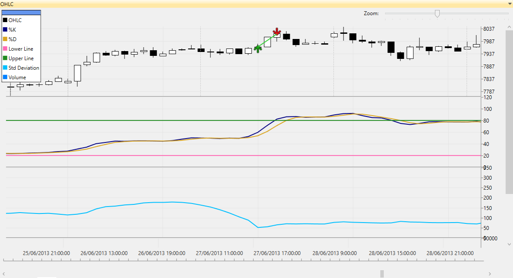
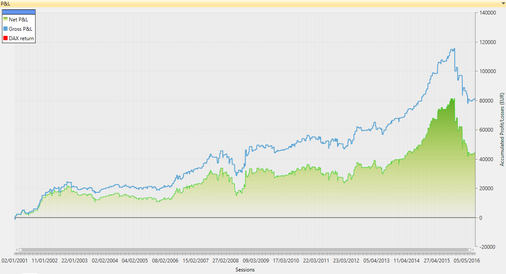

Tyrion Trading Strategy
============================================

Table of Contents
----

* [Overview](#overview)
* [Tyrion Trading Rules](#tyrion-trading-rules)
* [Download](#download)
* [Quick Start](#quick-start)
* [User Manual](#user-manual)
* [About iSystems](#about-isystems)
* [Disclaimer](#disclaimer)

Overview
----

Tyrion is a trading algorithm written in C# using the [TradingMotion SDK] development tools (there is a [VB.net] port too).


<sub>__Image footnote:__ Example of Tyrion OHLC financial chart showing some automatic trades</sub>

The strategy code is all contained in [TyrionStrategy.cs], including a default parameter combination.

This default parameter combination has been optimized to run over 60' bars of _DAX Future Index_.

Trading a maximum of 1 contract of DAX Future, this is how performed (hypothetically) from 2001 to 20014:


<sub>__Image footnote:__ Hypothetic Net P&L chart for Tyrion strategy</sub>

Anyway, go open Visual Studio, clone the project and start with the trading algo development! Sure you can do better and improve all these figures :)

Tyrion Trading Rules
----

Tyrion's trading plan is quite simple. It __buys 1 contract__ when the price breaks above a specified Stochastic %D's level.

While the strategy has a long position in the market, it __places one exit order__. A _Take Profit_ (close the position with a profit) based on the standard deviation.

Besides, this is a pure __intraday strategy__. That means it won't leave any open position at the end of the session, so in case we still got a position it will be closed automatically.

### To sum up ###
```
TyrionStrategy rules:

  * Entry: Price breaks Stochastic %D level (long-only)
  * Exit: Sets a Take Profit (objective) order based on price standard deviation
  * Filters (sets the entry only under certain conditions): None
```

### Show me the code ###

Here is a simplified C# source code of Tyrion's _OnNewBar()_ function. The complete code is all contained in [TyrionStrategy.cs] along with comments and definition of parameters.

```csharp
// ========== ENTRIES ==========

if (this.GetOpenPosition() == 0)
{
	int buySignalLevel = (int)this.GetInputParameter("Stochastic %D Buy signal trigger level");

	if (stochasticIndicator.GetD()[1] <= buySignalLevel && stochasticIndicator.GetD()[0] > buySignalLevel)
	{
		Order buyOrder = new MarketOrder(OrderSide.Buy, 1, "Entry long");
		limitTakeProfitOrder = new LimitOrder(OrderSide.Sell, 1, Bars.Close[0] + stdDevIndicator.GetStdDev()[0], "Exit long (take profit stop)");

		this.InsertOrder(buyOrder);
		this.InsertOrder(limitTakeProfitOrder);
	}
}
```

Download
----

First of all, make sure you have Visual Studio 2010 version (or higher). [TradingMotion SDK] is fully compatible with [Visual Studio Express] free versions.

Download TradingMotion [Visual Studio extension], and the windows desktop application [TradingMotionSDK Toolkit installer].


Quick Start
----

* Create a free account to access TradingMotionAPI (required). It can be created from TradingMotionSDK Toolkit (the desktop application)
* Clone the repository:
```sh
git clone https://github.com/victormartingarcia/tyrion-trading-strategy-csharp
```
* Open Visual Studio and load solution _TyrionStrategy/TyrionStrategy.sln_
* Edit _app.config_ file adding your TradingMotionAPI credentials on _appSettings_ section

And you're all set!

Running the project (F5) will perform a _development backtest simulation_ over last 6 months DAX 60' bars data.

Once it has finished, it will ask if you want to see the P&L report in TradingMotionSDK Toolkit. Pressing 'y' will load the same backtest with the desktop app, where it will show performance statistics, charts, and so on.

User Manual
----

__[More documentation in the Getting Started Guide]__

About iSystems
----

[iSystems] by [TradingMotion] is a marketplace for automated trading systems.

_iSystems_ has partnered with [11 international brokers](http://www.tradingmotion.com/Brokers) (and counting) that offer these trading systems to their clients (both corporate and retail) who pay for a license fee that the developer charges.

The trading systems run with live market data under a controlled environment in iSystems' datacenters.

This way the developers just need to worry about how to make their trading systems better and iSystems platform does the rest.

Visit [Developers] section on TradingMotion's website for more info on how to develop and offer your systems.

Disclaimer
----

I am R&D engineer at [TradingMotion LLC], and head of [TradingMotion SDK] platform. Beware, the info here can be a little biased ;)

  [VB.net port]: https://github.com/victormartingarcia/tyrion-trading-strategy-vbnet
  [TradingMotion SDK]: http://sdk.tradingmotion.com
  [TyrionStrategy.cs]: TyrionStrategy/TyrionStrategy.cs
  [iSystems platform]: https://www.isystems.com
  [iSystems.com]: https://www.isystems.com
  [iSystems]: https://www.isystems.com
  [TradingMotion LLC]: http://www.tradingmotion.com
  [TradingMotion]: http://www.tradingmotion.com
  [Developers]: http://www.tradingmotion.com/Strategies/Developers
  [Visual Studio Express]: http://www.visualstudio.com/en-us/downloads#d-2010-express
  [TradingMotion SDK website]: http://sdk.tradingmotion.com
  [TradingMotionSDK Toolkit installer]: http://sdk.tradingmotion.com/files/TradingMotionSDKInstaller.msi
  [Visual Studio extension]: http://sdk.tradingmotion.com/files/TradingMotionSDK_VisualStudio.vsix
  [More documentation in the Getting Started Guide]: http://sdk.tradingmotion.com/GettingStarted
